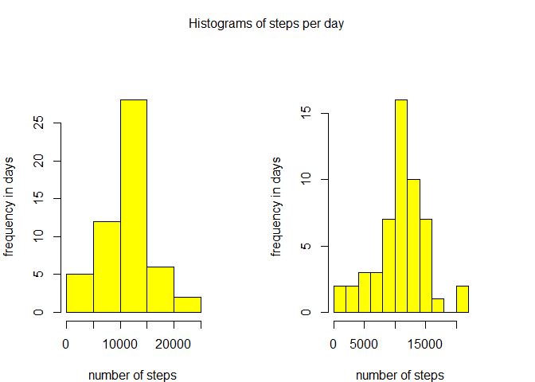
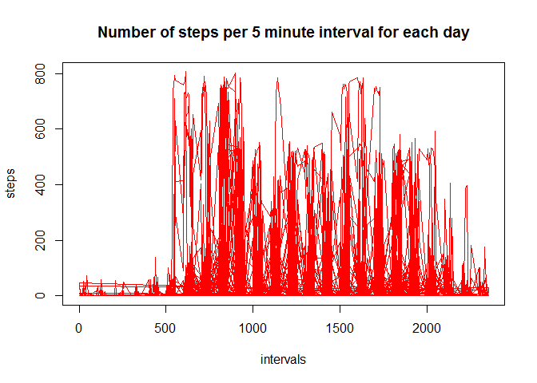
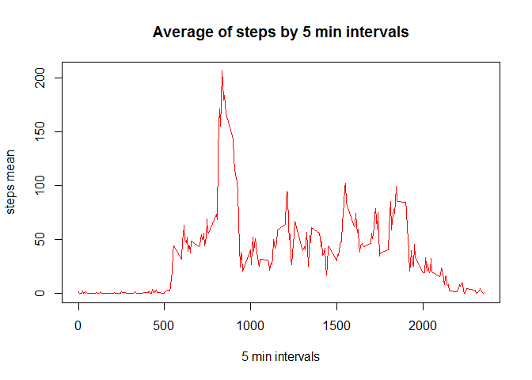
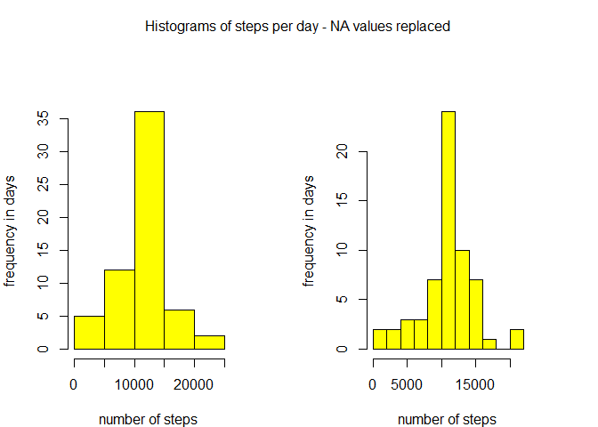
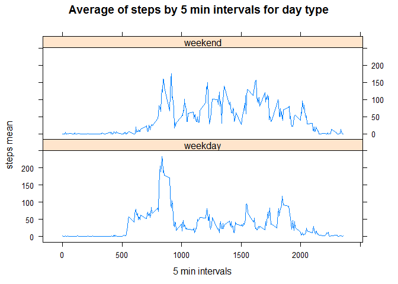
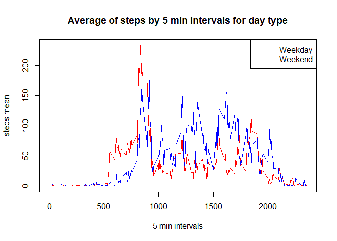

# Reproducible Research: Peer Assessment 1


***
## Loading and preprocessing the data

Loading dependencies:

```r
library(knitr)
library(lattice)
library(dplyr)
```

```
## 
## Attaching package: 'dplyr'
## 
## The following object is masked from 'package:stats':
## 
##     filter
## 
## The following objects are masked from 'package:base':
## 
##     intersect, setdiff, setequal, union
```
***
Loading data and finding dates for future reference:

```r
act.data <- read.csv("activity.csv")
act.dates <- levels(act.data$date)
```
***
## What is mean total number of steps taken per day?

Making histogram of steps taken per day:

```r
act.steps <- aggregate(act.data$steps ~ act.data$date, data=act.data, FUN=sum)
colnames(act.steps) <- c("date","steps")

## creating histograms
par(mfrow = c(1, 2), mar = c(4, 4, 4, 4), oma = c(0, 0, 2, 0))
with(act.steps, {
        hist(steps, xlab="number of steps", ylab="frequency in days", main="", col = "yellow")
        hist(steps, breaks = 10, xlab="number of steps", ylab="frequency in days", main="", col = "yellow")
        mtext("Histograms of steps per day", outer = TRUE)
})
```

 

- I have made two histograms, each with different number of bars (breaks)
- Between 1200 and 1500 steps per day is by far most frequent step number and out of that section frequency of 1000 to 1200 steps is the largest segment 

***  
Mean of total number of steps:

```r
steps.mean <- mean(act.steps$steps)
steps.mean
```

```
## [1] 10766.19
```
***
Median of total number of steps:

```r
steps.median <- median(act.steps$steps)
steps.median
```

```
## [1] 10765
```
***
## What is the average daily activity pattern?

Time series plot of the 5-minute interval and the average number of steps taken, averaged across all days:

```r
plot(act.data$interval, act.data$steps, xlab="intervals", ylab="steps", main="Number of steps per 5 minute interval for each day", col="red", type="l")
```

 

- This plot is somewhat unclear but we can see that main activity intervals are somewhere between 7 and 9 hrs (intervals 700 to 900)  
- I have made another plot showing the mean values for each interval

***
Histogram of mean values of 5-intervals for all days:

```r
intervals <- unique(as.vector(act.data$interval))
act.data.omit.na <- na.omit(act.data)

steps.intervals <- c()

for (i in intervals)
        {
                interval.select <- filter(act.data.omit.na, interval==i)
                steps.mean.select <- mean(interval.select$steps)
                steps.intervals <- append(steps.intervals, steps.mean.select)
        }
steps.data <- data.frame(x = intervals, y = steps.intervals)
colnames(steps.data) <- c("intervals","step.mean")

plot(steps.data$intervals, steps.data$step.mean, xlab="5 min intervals", ylab="steps mean", main="Average of steps by 5 min intervals", col="red", type="l")
```

 

- This plot shows activity by interval much clearer

***
5-minute interval that (on average across all the days in the dataset) contains the maximum number of steps:

```r
steps.mean.top <- arrange(steps.data, desc(step.mean))[1,1]
steps.mean.top
```

```
## [1] 835
```
***
## Imputing missing values

Total number of rows with missing values in the dataset:

```r
missing.values <- nrow(act.data) - nrow(act.data.omit.na)
missing.values
```

```
## [1] 2304
```
***
Replacing missing values with mean average values for each day:

```r
act.steps.mean <- aggregate(act.data$steps ~ act.data$date, data=act.data, na.action = na.pass, FUN=mean)
act.steps.mean.nona <- aggregate(act.data$steps ~ act.data$date, data=act.data, FUN=mean)
colnames(act.steps.mean) <- c("date","step.mean")
colnames(act.steps.mean.nona) <- c("date","step.mean")
act.steps.mean[is.na(act.steps.mean)] <- mean(act.steps.mean.nona$step.mean)

data.na.added <- c()

for (j in act.dates)
        {
                selected.date <- filter(act.data, date == j)
                selected.date.mean <- filter(act.steps.mean, date == j)
                selected.date[is.na(selected.date)] <- selected.date.mean[1,2]
                data.na.added <- append(data.na.added, selected.date$steps)
        }
```
***
Creating new dataset equal to original dataset but with missing data filled in:

```r
act.data.full <- data.frame(data.na.added,act.data$date,act.data$interval)
colnames(act.data.full) <- c("steps","date","interval")
```
***
Making a histogram of the total number of steps taken each day using the new dataset:

```r
## total number of steps
act.steps.full <- aggregate(act.data.full$steps ~ act.data.full$date, data=act.data.full, FUN=sum)
colnames(act.steps.full) <- c("date","steps")

## creating histogram
par(mfrow = c(1, 2), mar = c(4, 4, 4, 4), oma = c(0, 0, 2, 0))
with(act.steps.full, {
        hist(steps, xlab="number of steps", ylab="frequency in days", main="", col = "yellow")
        hist(steps, breaks = 10, xlab="number of steps", ylab="frequency in days", main="", col = "yellow")
        mtext("Histograms of steps per day - NA values replaced", outer = TRUE)
})
```

 

- I have made two histograms, each with different number of bars (breaks)
- Histograms are visually similar to the ones made using original data but frequency tends greatly toward average number of steps per day

***
Mean of total number of steps:

```r
steps.full.mean <- mean(act.steps.full$steps)
steps.full.mean
```

```
## [1] 10766.19
```
***
Median of total number of steps:

```r
steps.full.median <- median(act.steps.full$steps)
steps.full.median
```

```
## [1] 10766.19
```
***
## Are there differences in activity patterns between weekdays and weekends?

Setting local time for “English”:

```r
Sys.setlocale("LC_TIME", "English")
```

```
## [1] "English_United States.1252"
```
***
Creating a new factor variable in dataset (with labels “weekdays” and “weekend”) indicating whether a given date is a weekday or weekend day:

```r
act.days <- as.Date(act.data$date)
week.days <- weekdays(act.days)
day.type <- c()

for (k in c(1:length(week.days)))
        {
                if (week.days[k]=="Sunday" || week.days[k]=="Saturday")
                {
                        day.type <- append(day.type,"weekend")
                }
                else
                {
                        day.type <- append(day.type,"weekday")
                }
        }
day.type <- as.factor(day.type)
act.data.days <- cbind(act.data,day.type)
```
***
Time series plot of the 5-minute interval and the average number of steps taken for “weekend“ days and “weekday” days:

```r
act.data.days.omit.na <- na.omit(act.data.days)

## weekend
steps.intervals.weekend <- c()

for (i in intervals)
{
        interval.select <- filter(act.data.days.omit.na, interval==i & day.type=="weekend")
        steps.mean.select <- mean(interval.select$steps)
        steps.intervals.weekend <- append(steps.intervals.weekend, steps.mean.select)
}

steps.data.weekend <- data.frame(x = intervals, y = steps.intervals.weekend)
colnames(steps.data.weekend) <- c("intervals","step.mean")

## weekday
steps.intervals.weekday <- c()

for (i in intervals)
{
        interval.select <- filter(act.data.days.omit.na, interval==i & day.type=="weekday")
        steps.mean.select <- mean(interval.select$steps)
        steps.intervals.weekday <- append(steps.intervals.weekday, steps.mean.select)
}

steps.data.weekday <- data.frame(x = intervals, y = steps.intervals.weekday)
colnames(steps.data.weekday) <- c("intervals","step.mean")

steps.data.all <- rbind(steps.data.weekday, steps.data.weekend)
steps.data.all <- cbind(steps.data.all, rep(c("weekday","weekend"), each=288))
colnames(steps.data.all) <- c("intervals","step.mean","day.type")

## lattice
xyplot(step.mean ~ intervals|day.type, 
                data=steps.data.all,
                main = "Average of steps by 5 min intervals for day type",
                xlab = "5 min intervals", 
                ylab = "steps mean",
                type = "l",
                layout=c(1,2))
```

 


```r
plot(steps.data.weekday$intervals, steps.data.weekday$step.mean, xlab="5 min intervals", ylab="steps mean", main="Average of steps by 5 min intervals for day type", col="red", type="l")
lines(steps.data.weekend$intervals,steps.data.weekend$step.mean, col = "blue")
legend("topright", legend = c("Weekday", "Weekend"), lty = 1, col = c("red", "blue"))
```

 

- Difference in activity by interval is much clearer if we show it on the same graph
